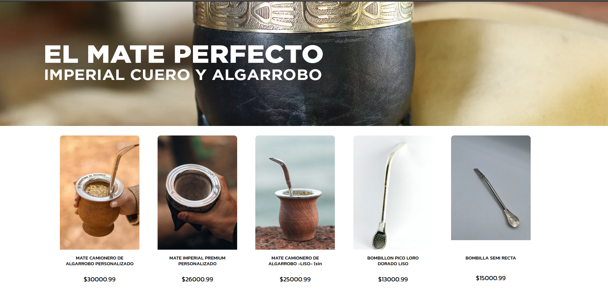

# Fronend Rincon Matero
---



This is the front-end of rincon matero system. [Rincon Matero Back-end](https://github.com/nahuelRo/rincon-matero-back) connects here.

### Technologies
The project is developed in:
   
* [Vite](https://vitejs.dev/) 
* [React](https://es.react.dev/) 
* [Redux](https://es.redux.js.org/) 
* [Sass](https://sass-lang.com/) 


### Required programs
---

In order to use the project on localhost it is necessary to clone it and have some necessary programs:

 * [node.js](https://nodejs.org/es) v18.17.1 lts or Higher.
 * Development IDE of your convenience Ej. [VS Code](https://code.visualstudio.com/)
 * Backend Server.
 * GIT to manage versions.

### How to Clone
---

Command to clone:

```bash
git clone https://github.com/nahuelRo/rincon-matero-front
```

### Install
---

Once the project is cloned, it is necessary to install all the dependencies with the command:

```bash
npm install
```

Run en LocalHost:

```bash
npm run dev
```

### Upload changes
---

To upload the changes we use 4 branches, Both bugfixes and features are merged into the development branch.

* Main (Production branch)
* Develop (Development branch)
* feature/your_new_feature 
* bugfix/bug_fixed 


### Structure folders
---

- src
- ├── /assets
- ├── /state
- ├── /components
- ├── /styles
- ├── /commons
- ├── /hooks
- ├── /utils
- └── App.jsx
- └── main.jsx


### Collaborators
---

<p>
Agustin Sandoval
</p>

<a href="https://github.com/Tute22">

</a>
<a href="https://www.linkedin.com/in/agustín-andres-sandoval-641950267/"></a>


<p>
Kevin Nuñez
</p>
<a href="https://github.com/b1ractive">

</a>
<a href="https://www.linkedin.com/in/kevin-nuñez-455054214/"></a>


<p>
Brian Barrientos
</p>

<a href="https://github.com/BrianBts">

</a>
<a href="https://www.linkedin.com/in/braian-barrientos-49591112a/"></a>

<p>
Esteban Rodriguez
</p>

<a href="https://github.com/nahuelRo">

</a>
<a href="https://www.linkedin.com/in/esteban-nahuel-rodriguez-514775203/"></a>
